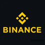
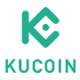
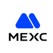

<h3 align="center">⭐加密货币入门指南,全网最全虚拟币资源库⭐</h3>
<h3 align="center">⭐比特币区块链学习资料，币圈最新最快资讯⭐</h3>

## 📖前言
- 欢迎访问全网全面、专业、实时更新的区块链与加密货币资源平台，本站专为币圈新手、投资者及 Web3 爱好者打造，提供一站式信息整合与实用工具导航服务，助力用户快速入门加密资产世界，轻松掌握行业核心知识与操作技能。 

- 本站汇集主流中心化交易所官方注册链接与正版官网入口，包括币安 Binance、欧易 OKX、预测市场 polymarket、芝麻开门 Gate 等知名交易平台，并提供详细的注册流程、使用教程与安全操作指南，帮助用户安全便捷地使用主流交易服务。 

- 除此之外，平台还全面收录加密货币行业高频实用资源，涵盖实时行情数据分析、巨鲸资金流向监控、NFT 市场行情动态、优质空投项目推送、链上数据查询分析、DeFi 协议介绍与使用教程、DAO 社区运作模式、跨链桥接工具推荐、安全加密钱包选型等内容，全方位满足币圈用户学习、查询、交易与投资需求。 

- 我们始终致力于为广大用户提供最新、最全、最可靠的加密货币工具与学习资料，降低行业信息获取门槛，提升投资与操作安全度。同时欢迎社区用户积极反馈、补充优质资源，与我们共同打造开放、共享、高效的区块链知识与工具库。 

- 关注本站，从零开始系统学习加密资产投资，深入探索 Web3 生态，开启属于你的加密世界探索之旅。 

&nbsp;
&nbsp;

## 🚀科学上网工具

- [vpnnav.github.io](https://vpnnav.github.io)

- 请注意，以上工具仅供学习使用若利用这些工具从事违法犯罪行为，我们概不承担任何法律责任

&nbsp;
&nbsp;

## 📖加密货币交易所
| [ 币安](https://accounts.binance.com/zh-CN/register?ref=FANXIAN) | [ 欧意OKX](https://www.okx.com/zh-hans/join/50253981) |  [ bitget](https://www.bitget.com/zh-CN/referral/register?clacCode=QR4A7MPY) |[ ByBit](https://www.bybit.com/invite?ref=4VLKDMW) | [ 火币](https://www.htx.com.am/invite/zh-cn/1f?invite_code=xpi6a223) |
|:---:|:---:|:---:|:---:|:---:|
| [ CoinBase](https://www.coinbase.com/) | [ kraken海妖](https://www.kraken.com/) | [ KuCoin](https://www.kucoin.com) | [ 抹茶MEXC](https://promote.mexc.com/r/wIE7fPvG) | [ Gate.io](https://www.gatenode.xyz/share/USDTOKOK) |

&nbsp;
&nbsp;

## 💰一定要使用邀请码注册，否则无法减免手续费💰

| 交易所 | 官方链接 | 描述 |
| :---------| :----------| :----------|
| 币安 | [https://www.binance.com](https://accounts.binance.com) | 使用邀请码注册：0000 、减免40%手续费，币安Alpha积分活动，每个月靠空投可以领上万块，有兴趣可以学习下怎么刷[币安刷Alpha积分视频教程](https://www.youtube.com/results?search_query=%E5%B8%81%E5%AE%89alpha) |
| 欧易OKX | [https://www.okx.com](https://www.okx.com) | 使用邀请码注册：0000 、减免30%手续费 |
| ByBit | [https://www.bybit.com](https://www.bybit.com) | 使用邀请码注册：0000 、减免30%手续费 |
| Bitget | [https://www.bitget.com](https://www.bitget.com) | 使用邀请码注册：0000 、减免40%手续费 |
| Gate.io | [https://www.gatesee.com](https://www.gatenode.xyz) | 使用邀请码注册：0000 、减免40%手续费 |
| 火币 | [https://www.htx.com](https://www.htx.com) | 使用邀请码注册：0000 、减免30%手续费 |
| 抹茶 | [https://www.mexc.co](https://promote.mexc.com) | 使用邀请码注册：0000 、减免40%手续费 |

### 常见问题
- [🚀 币安注册全攻略 2026 版](./docs/币安交易所注册教程) - 从注册到首单，手把手教你解锁独家邀请码与永久手续费减免。这一篇让你丝滑入场，立省真金白银！
- [✅ KYC验证零失败指南](./docs/币安身份验证常见问题及解决方法) - 针对证件识别失败、人脸验证异常等常见痛点，提供经过验证的标准化解决方案。助您快速完成合规认证，开启全额交易权限。
- [📱 境外手机卡推荐](./docs/境外手机卡推荐) -  拒绝高昂漫游费！深挖全球高性价比境外手机卡，月租起底 + 实测对比。
- [💳 U卡全景解密](./docs/U卡是什么？) - 一文讲透 U 卡的底层逻辑、分类玩法与致命风险。数字货币从业者的必备生存工具书，读懂它，资金流转更自由。
- [🌲 穿越牛熊：币圈新手的进阶生存指南](./docs/币圈赚钱入门指南) - 抛弃暴富幻想，直面血腥丛林！掌握这套“暗黑森林”存活逻辑，你才能在波动中不仅活下来，还能带走利润。

&nbsp;
&nbsp;
## 📖市场聪明钱监控

- [@hyperbot](https://hyperbot.network/)   由AI驱动的链上永续合约交易平台：数据分析、巨鲸追踪、智能跟单、策略交易
- [@Debot](https://debot.ai)   可以实时跟踪聪明钱包的交易下单情况，跟紧聪明人做交易
- [@gmgn.ai](https://gmgn.ai)   专注市场火爆MEME的跟踪交易辅助平台，更有复制交易和风险提示等功能

&nbsp;
&nbsp;

## 📖Web3资料学习
- [比特币白皮书](https://bitcoin.org/bitcoin.pdf) - Bitcoin: A Peer-to-Peer Electronic Cash System
- [以太坊白皮书](https://ethereum.org/en/whitepaper/) - Ethereum: A Next-Generation Smart Contract and Decentralized Application Platform
- [Uniswap V2 白皮书](https://uniswap.org/whitepaper.pdf) - Uniswap V2 协议设计与原理
- [Uniswap V3 白皮书](https://uniswap.org/whitepaper-v3.pdf) - Uniswap V3 协议设计与改进
- [Bitcoin: A Peer-to-Peer Electronic Cash System](https://bitcoin.org/bitcoin.pdf) - 比特币白皮书：一种点对点的匿名货币交易系统
- [以太坊黄皮书](https://ethereum.github.io/yellowpaper/paper.pdf)
- [区块链黑暗森林自救手册](https://github.com/slowmist/Blockchain-dark-forest-selfguard-handbook/blob/main/README_CN.md) - 慢雾团队编写的区块链安全防护与自救指南

## 📖加密货币新闻资讯
- [非小号](https://www.feixiaohao.co/) - 国内行情工具，覆盖币种信息、交易所动态  
- [金十数据](https://www.jin10.com/) - 金十数据致力于成为国内专业的财经新闻软件和交易工具  
- [金色财经](https://www.jinse.cn) - 客观、公正、全面的资讯平台，紧盯互联网技术落地应用、突发事件、热门话题、政策跟进等  
- [CoinMarketCap](https://coinmarketcap.com/zh/) - 最全面的加密货币数据分析平台  
- [Coingecko](https://www.coingecko.com/) - 提供项目评分和综合排序，便于评估项目  
- [比特币巨鲸追踪](https://bitinfocharts.com/zh/top-100-richest-bitcoin-addresses.html) - 追踪比特币前100富有地址   
- [以太坊基金会博客](https://blog.ethereum.org/) - 官方以太坊基金会发布的博客，内容涵盖最新技术和社区动态  
- [coindesk](https://www.coindesk.com/) - 全球领先的加密货币新闻平台，提供行业动态和深度分析  
- [cointelegraph](https://cointelegraph.com/) - 国际区块链和加密货币新闻媒体，提供及时资讯和专题报道  
- [律动](https://www.theblockbeats.info/) - 区块链及数字货币行业信息平台，内容包括行情、深度分析等  
- [PANews - 区块链新闻资讯](https://www.panewslab.com/zh/index.html) - 专业区块链新闻资讯服务平台  

### 区块链浏览器
- [Linea区块浏览器](https://lineascan.build) - Linea浏览器
- [Combo测试网浏览器](https://combotrace-testnet.nodereal.io/) - Combo测试网浏览器
- [Dogecoin区块浏览器](https://chain.so/DOGE) - Dogecoin浏览器
- [zkSync Era区块浏览器](https://explorer.zksync.io) - zkSync Era浏览器
- [HECO SCAN](https://hecoinfo.com) - HECO链浏览器
- [EOS浏览器](https://eostracker.io) - EOS浏览器
- [Blockchain](https://www.blockchain.com/explorer) - 比特币浏览器
- [Aptos](https://explorer.aptoslabs.com/) - Aptos浏览器
- [MintScan](https://www.mintscan.io/cosmos) - Cosmos浏览器
- [CronosScan](https://cronoscan.com/) - Cronos浏览器
- [NearScan](https://www.nearscan.org/home) - Near浏览器
- [AlgoScan](https://algoscan.app/) - Algorand浏览器
- [GnosisScan](https://gnosisscan.io/) - Gnosis浏览器
- [FilScan](https://filscan.io/) - Filecoin浏览器
- [AVASCAN](https://avascan.info/) - Avalanche浏览器
- [TRONSCAN](https://tronscan.org/) - TRON浏览器
- [FTMScan](https://ftmscan.com/) - Fantom浏览器
- [Subscan](https://www.subscan.io/) - 波卡生态浏览器
- [Solscan](https://solscan.io/) - Solana浏览器
- [polygonscan](https://polygonscan.com/) - Polygon浏览器
- [BscScan](https://www.bscscan.com/) - BSC浏览器
- [Arbiscan](https://arbiscan.io/) - Arbitrum浏览器
- [OP浏览器](https://optimistic.etherscan.io/) - Optimism浏览器
- [Blockscout](https://blockscout.com/eth/mainnet/) - EVM链浏览器
- [Blockchair](https://blockchair.com/) - 多链浏览器
- [Etherscan](https://etherscan.io) - 以太坊浏览器

### 币种官网
- [Bitcoin](https://bitcoin.org) - 比特币官网
- [以太坊](https://ethereum.org) - 以太坊官网
- [USDT](https://tether.to) - USDT官网
- [XRP](https://ripple.com/xrp) - XRP官网
- [Solana](https://solana.com) - SOL币官网
- [Cardano](https://cardano.org) - ADA币官网
- [Sand](https://www.sandbox.game) - Sandbox官网
- [MANA(Decentraland)](https://decentraland.org) - Decentraland官网
- [BitDAO](https://www.bitdao.io) - BitDAO官网
- [Jasmy](https://www.jasmy.co.jp) - Jasmy官网
- [XMR](https://www.getmonero.org) - Monero官网
- [Matic/Polygon](https://polygon.technology) - Polygon官网
- [Dogecoin](https://dogecoin.com) - Dogecoin官网

## 钱包

### 软件钱包

- [MetaMask](https://metamask.io/) - 浏览器扩展与移动端钱包，支持以太坊及 EVM 链，可连接 DApp 与 DeFi 平台。  
- [Trust Wallet](https://trustwallet.com/) - 多链移动钱包，支持上百种区块链资产，内置 DApp 浏览器。  
- [Coinbase Wallet](https://www.coinbase.com/wallet) - Coinbase 官方非托管钱包，支持多链资产与 NFT 管理。  
- [Exodus](https://www.exodus.com/) - 桌面与移动端兼容的钱包，界面友好，集成交易与资产管理功能。  
- [Electrum](https://electrum.org/) - 经典比特币软件钱包，轻量高效，适合资深用户使用。  
- [Phantom](https://phantom.com/) - 主打 Solana 生态的钱包，支持 NFT 与多链管理，界面现代简洁。  
- [MyEtherWallet (MEW)](https://www.myetherwallet.com/) - 以太坊专用钱包，支持 ERC-20 代币及智能合约交互。  
- [MyCrypto](https://www.mycrypto.com/) - 开源以太坊钱包，支持多种 ERC-20 代币与离线操作。  
- [ZenGo](https://zengo.com/) - 无助记词钱包，采用 MPC 安全技术，操作简单且安全性高。  
- [Rainbow](https://rainbow.me/) - 以太坊生态钱包，专注于 NFT 和 DeFi，界面时尚易用。  
- [TokenPocket](https://www.tokenpocket.pro/) - 多链支持的钱包，兼具移动端与桌面端，集成交易与 DApp 功能。  
- [ImToken](https://www.token.im/) - 多链钱包，支持资产管理与 DApp 访问，界面清晰易用。  
- [BitKeep (Bitget Wallet)](https://web3.bitget.com/) - 全球化多链钱包，支持上百条公链与跨链兑换。  
- [OKX Wallet](https://www.okx.com/web3) - OKX 推出的多链钱包，支持 Web3、NFT 与去中心化交易。  
- [SafePal](https://www.safepal.io/) - 币安投资的钱包品牌，支持软件与硬件结合的多链管理方案。  
- [Atomic Wallet](https://atomicwallet.io/) - 支持300多种加密货币的桌面和移动端钱包，提供原子交换和Staking功能。

### 硬件钱包

- [Ledger](https://www.ledger.com/) - 全球知名的硬件钱包品牌，以安全性和多币种支持著称。  
- [Trezor](https://trezor.io/) - 行业内首批硬件钱包品牌，提供高安全性与友好操作体验。  
- [SafePal](https://www.safepal.io/) - 币安投资的硬件钱包，支持多链资产与离线签名功能。  
- [OneKey](https://onekey.so/) - 国产多功能硬件钱包，支持多币种与跨平台使用。  
- [BITHD](https://bithd.com/) - 便携式硬件钱包，专注冷存储解决方案，安全稳定。  
- [Ballet](https://www.balletcrypto.com/zh/) - 实体冷钱包，操作简洁，无需电子设备即可使用。  
- [Ellipal](https://www.ellipal.com/) - 全封闭式冷钱包，采用二维码签名，完全隔离网络连接。  
- [Keystone](https://keyst.one/) - 支持多币种的安全硬件钱包，内置摄像头扫码签名。  
- [CoolWallet](https://www.coolwallet.io/) - 银行卡形态的硬件钱包，轻薄便携，支持移动端蓝牙连接。  
- [Tangem](https://tangem.com/) - NFC 实体卡钱包，支持手机一触连接，适合日常使用。  
- [SecuX](https://secuxtech.com/) - 提供多型号硬件钱包，兼顾安全性与用户体验。  
- [BitBox](https://shiftcrypto.ch/bitbox02/) - 瑞士出品的硬件钱包，注重隐私保护与开源安全。  
- [GridPlus Lattice1](https://gridplus.io/) - 企业级安全芯片硬件钱包，配备触控屏与模块化设计。  
- [CoolBitX](https://www.coolbitx.com/) - 专为移动端用户设计的蓝牙硬件钱包，安全便捷。  
- [KeepKey](https://shapeshift.com/keepkey) - 经典硬件钱包之一，设计简约，支持主流币种与 ShapeShift 集成。  
